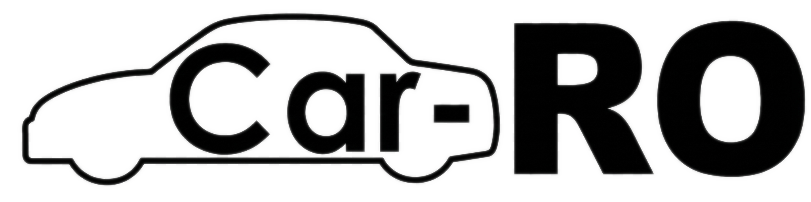
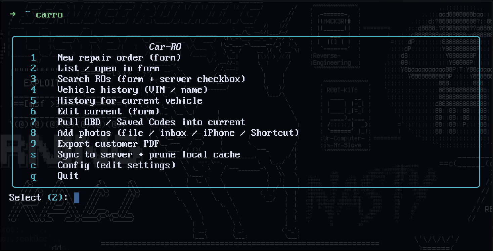
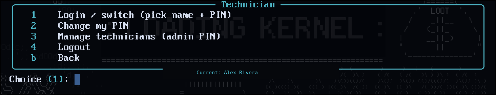
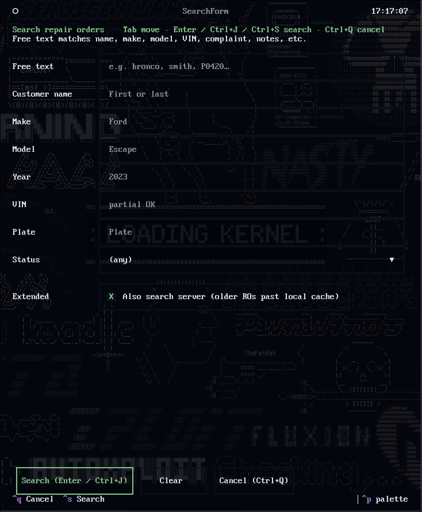
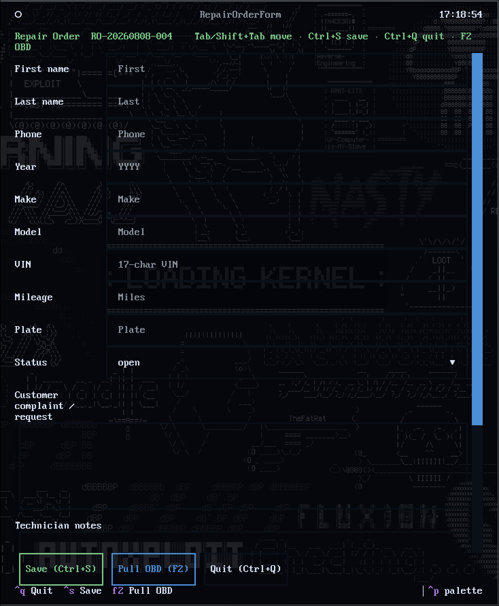
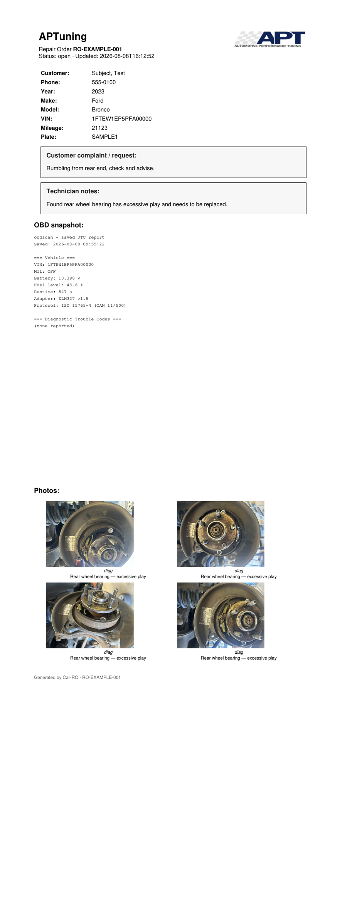

<p align="center">
  <picture>
    <source media="(prefers-color-scheme: dark)" srcset="docs/branding/carro-wordmark-on-dark.png" />
    
  </picture>
</p>

# Car-RO

**Technician repair-order notes for people who also like running their own gear.**
This is a technician-made RO workflow project aimed to assist independent shops and technicians to have a way to streamline their workflow and help track efficiency with repair orders with individual timed work item to keep track of time spent, not only on the car itself, but also each task assign on each job.

Car-RO documents diagnostic and repair work — the stuff you wish you’d written down *while you were still under the hood*. It is **not** a DMS, not billing, and not meant to replace your shop’s official RO system. It is a personal / bay-side knowledge base that happens to spit out a clean PDF a service advisor can read.

Use the **CLI** if you like the terminal workflow, or the **desktop GUI** (Orders + Scanner) if you want a mouse-driven shop tool — same data, same config, same server. The GUI also wraps the cheap ELM327 / GT327 scan path for people who mainly want a proper scan tool UI.

Built for mechanics and techs who:

- Have a **Linux laptop** (or similar) and are willing to open a terminal — you do **not** need to be a GitHub expert
- Want **searchable history** of past jobs (“what fixed that intermittent wiper on the last Ford?”)
- Want a **typed PDF** for the advisor instead of chicken-scratch on a carbon form
- Want **phone photos** attached to the write-up without fighting AirDrop into a random Downloads folder every time

**Start here:** use a **[Release](https://github.com/Dhxqhu/Car-RO/releases/latest)** (download the zip). That is the supported path for first-time installs. Optional home-lab server / Tailscale comes later — local-only works fine on day one.

### Companion tools & hardware

| | Link |
| --- | --- |
| **obdscan** (CLI OBD companion) | [Releases](https://github.com/Dhxqhu/obdscan/releases/latest) · [repo](https://github.com/Dhxqhu/obdscan) |
| **GODIAG GT327** (ELM327 Bluetooth + DoIP/ENET adapter) | [Amazon](https://www.amazon.com/dp/B0DKXPRLPP) · [Godiag product page](https://www.godiagshop.eu/wholesale/godiag-gt327.html) |

Car-RO can pull VIN / vehicle / DTC context from **obdscan** (and its Saved Codes exports) into a repair order. **obdscan** exists because Linux software for cheap ELM327 / GT327 adapters is scarce — the usual apt GUI (`scantool`) is ancient, and almost nothing uses the GT327’s DoIP ethernet mode. Car-RO is the write-up side of that same bay workflow.

---

## Why it exists

As a tech you already know the loop:

1. Fix something clever.
2. Forget the exact symptom / part / gotcha six months later.
3. Burn time rediscovering it on the next similar car.

Car-RO is the habit-forming middle step: open a job, dump complaint + notes + OBD snapshot + photos, export a PDF, sync to your box at home. Future-you (and your bay) get a trail.

---

## What you get

| Piece | What it does |
| --- | --- |
| **CLI (`carro`)** | Interactive menu + full-screen forms for new / edit / search |
| **Desktop GUI** | Orders workspace + Scanner (obdscan) — Windows & Linux |
| **Local SQLite** | Fast cache of recent ROs on the laptop |
| **Customer PDF** | Shop header/logo, boxed complaint & tech notes, OBD block, photos + captions |
| **Optional server** | Bulk storage on *your* disk(s), multi-volume aware |
| **Photo ingress** | Modular: local files, inbox drop, Tailscale QR upload from phone |

Local-only works fine. The server is for people who want history that outlives a laptop SSD and who already mesh their devices with something like Tailscale.

### Screenshots

#### Desktop GUI


*Technician login with brand wordmark and 4-box PIN.*


*Orders workspace — bay cache list, sync, history.*


*Scanner workspace — obdscan connect / engine bridge (no PIN required for scanner-only).*

#### CLI



*Main menu after technician PIN login (name on the banner). Demo tech name only.*



*Menu **`t`**: switch tech, change PIN, manage roster (admin), logout.*





### Example PDF output



*Example only.* Shop name and logo are placeholders to show how branding appears on a finished PDF — not a claim about any particular workplace. Customer / VIN / plate values in the sample are fictional demo data.

---

## Quick install (workstation)

You need: **Linux** or **Windows** and **Python 3.10+**. One install script does the rest.

| OS | Install |
| --- | --- |
| **Linux** | `./scripts/install.sh` (below) |
| **Windows** | Double-click **`Install-Car-RO.bat`** — full guide: [docs/WINDOWS.md](docs/WINDOWS.md) |

### Easiest: download a Release (recommended)

1. Open **[the latest Release](https://github.com/Dhxqhu/Car-RO/releases/latest)**  
2. Under **Assets**, download **Source code (zip)**  
3. Unzip it somewhere you keep tools (e.g. `~/Documents/Car-RO` or `Documents\Car-RO`)  

**Linux:**

```bash
cd ~/Documents/Car-RO   # or wherever you unzipped (folder name may include a version)
./scripts/install.sh
carro
```

**Windows:** open the unzipped folder in File Explorer and double-click **`Install-Car-RO.bat`** (not the `.ps1`), then open Windows Terminal and run `carro`.  
If the `.bat` is blocked, or double-clicking a `.ps1` asks “which app?”: copy the folder path from Explorer → open PowerShell → `cd` to that path → `Set-ExecutionPolicy -Scope Process Bypass` → `.\scripts\install.ps1`.  
Full steps: [docs/WINDOWS.md](docs/WINDOWS.md).

That script will:

1. Create a local Python environment (`.venv`) and install dependencies  
2. Add a `carro` command under `~/.local/bin`  
3. Create `~/.config/carro/config.toml` if missing  
4. Create photo / inbox folders under `~/Documents/Car-RO/`  

If the terminal says `carro: command not found`, add `~/.local/bin` to your PATH — see [Terminal commands](#terminal-commands-carro-and-obdscan) below (copy/paste, one time).

Then:

```bash
carro                  # interactive menu
carro config           # shop name, logo, optional server, …
```

Set your shop name (and optional logo) in the config menu. **Do not** put real tokens, hostnames, or shop secrets into git — they stay in `~/.config/carro/`.

### Add your shop logo (PDF)

The logo shows **top-right** on customer PDFs. You do not need to edit config files by hand.

1. Save your logo as a **PNG** or **JPG** (e.g. into Downloads)  
2. Run either:

```bash
carro logo
# or: carro → c Config → 6 Shop logo
```

3. Pick the file from the list (or choose “I already saved logo.png in Documents/Car-RO/branding/”)  
4. Export a PDF (`carro pdf` or menu **9**) to check it  

Car-RO copies the image to `~/.config/carro/` for you. Change or clear it anytime from the same menu.

### Optional: install with git

If you already use git:

```bash
git clone https://github.com/Dhxqhu/Car-RO.git
cd Car-RO
./scripts/install.sh
```

**Upgrade later:** download the newer Release zip and run `./scripts/install.sh` again on Linux, or double-click **`Install-Car-RO.bat`** again on Windows (or `git pull` then the same install if you cloned).

### Manual install (same steps as the script)

```bash
cd /path/to/Car-RO
python3 -m venv .venv
.venv/bin/pip install -U pip
.venv/bin/pip install -r requirements.txt
mkdir -p ~/.local/bin ~/.config/carro
ln -sfn "$(pwd)/scripts/carro" ~/.local/bin/carro
ln -sfn "$(pwd)/scripts/carroadviser" ~/.local/bin/carroadviser
test -f ~/.config/carro/config.toml || cp config.example.toml ~/.config/carro/config.toml
carro config init   # optional: ensure token placeholder / dirs
```

### Terminal commands (`carro`, `carroadviser`, and `obdscan`)

Install puts launchers in `~/.local/bin`. That only works if that directory is on your `PATH`.

**1. Symlink (Car-RO does this in `./scripts/install.sh`):**

```bash
mkdir -p ~/.local/bin
# from your Car-RO checkout:
ln -sfn "$(pwd)/scripts/carro" ~/.local/bin/carro
ln -sfn "$(pwd)/scripts/carroadviser" ~/.local/bin/carroadviser
```

**2. Same idea for [obdscan](https://github.com/Dhxqhu/obdscan)** (after its venv + deps are set up):

```bash
cd /path/to/obdscan
mkdir -p ~/.local/bin
ln -sfn "$(pwd)/obdscan" ~/.local/bin/obdscan
```

**3. Put `~/.local/bin` on `PATH`** (once per shell config).

bash (`~/.bashrc`):

```bash
case ":$PATH:" in
  *":$HOME/.local/bin:"*) ;;
  *) export PATH="$HOME/.local/bin:$PATH" ;;
esac
```

zsh (`~/.zshrc`):

```bash
typeset -U path
path=("$HOME/.local/bin" $path)
```

Then reload (`source ~/.bashrc` / `source ~/.zshrc`) or open a new terminal.

**4. Check:**

```bash
which carro obdscan
carro --help          # or just: carro
obdscan --help
```

If `which` finds nothing, `PATH` is still wrong. If the command runs but Python imports fail, run `./scripts/install.sh` (Car-RO) or `./install.sh` (obdscan) from that project’s folder first.

---

## Daily use

```bash
carro                  # menu
carro new --from-obd   # new RO, try autofill from obdscan / Saved Codes
carro list
carro search ford
carro search --make ford --year 2023 --remote
carro history --vin 1FTEW1EP5PFA00000   # prior jobs for this car (server + local)
carro history --name smith              # fallback when VIN unknown
carro pull-obd RO-…
carro photo add ./pic.jpg --id RO-… --tag intake --note "LH wiper motor"
carro photo shortcut --id RO-… --tag intake  # iOS Share Sheet (setup page + ~7d URL)
carro photo phone --id RO-… --tag intake     # Tailscale QR → Safari
carro pdf RO-…
carro sync             # push to your server + prune local cache
                       # (if the server is down, edits stay on this PC and retry later)
```

### Vehicle history (VIN-first)

Prior work is looked up by **car**, not by person — same vehicle / new owner still finds the trail; multi-car households still work via name fallback.

- Menu **4** — full-screen VIN / name lookup (same style as Search) for stop-ins  
- Menu **5** — history for the **current** RO’s VIN (diag context; excludes the open job)  
- After OBD/VIN autofill — offered when prior ROs exist  
- After the history list: **text** (default diag pack: complaint / notes / OBD), **pdf** (full pack with photos; confirms if about more than 10 pages), **pdf-lite** (same without photos), or **pick** one RO to open / start new from customer+vehicle  
- Packs land in `~/.local/share/carro/history/`

**GUI New RO** (tech Orders list + advisor header): choose **Blank RO** or **Returning customer** (search VIN / name / phone → Use). That creates a fresh job with name, phone, and vehicle filled in — not mileage, notes, or work items. History’s **New RO for customer** does the same from a prior row.

If the shop server drops out (road test / Wi‑Fi gap), history and returning-customer search still use jobs already cached on that laptop (5s remote timeout). Creating a new RO from a prior that isn’t local yet needs the server or a Blank RO; once created, the new job stays local and syncs when the mesh is back.

**Autosync** (Config on tech + advisor): default **15 minutes** while the engine is open — pushes **dirty** ROs only, skips work when the queue is empty, and backs off if the server is unreachable. Set to `0` to turn the timer off; pending edits still retry every couple of minutes. On reconnect, the bell flushes pending sync then catches up missed events/messages. Shop messages show **Sent → Delivered → Read** on the sender’s Sent tab (Delivered = recipient bay received the message).

### Forms (Textual)

- **Tab / Shift+Tab** — fields  
- **Ctrl+S** — save  
- **Ctrl+Q** / **Esc** — quit without saving  
- **F2** — pull OBD / Saved Codes  
- Search submit: **Ctrl+J** (or Enter in a field)

### Config menu highlights

- **Local RO keep** / **Local photo keep** — how much history stays on *this* machine  
  - Use **`auto`** to size from free disk on the photos volume  
  - Older ROs can stay in metadata while photo files are pruned; server still holds bulk if configured  

---

## Photos (modular on purpose)

Photo intake is a **provider** interface so different shops / devices can plug in without rewriting the RO core.

| Path | Good for |
| --- | --- |
| **Local file / inbox** | Android, camera SD card, anything you can copy to the PC |
| **Tailscale QR upload** | Any phone on your mesh → Safari `/u/<token>` page |
| **iOS Shortcuts** | Share Sheet → POST to the same upload URL (`carro photo shortcut`) |

**Working iPhone flows**

1. RO open → menu **6** → **shortcut** or **phone**  
2. Tailscale on the phone  
3. **Shortcut (recommended for your iPhone):** open the setup page (QR), build *Car-RO Upload* once in Shortcuts, then Photos → Share → that Shortcut  
   **Phone page:** Safari → library or camera → optional notes → Upload  
4. Enter on the PC to refresh; files land in `~/Documents/Car-RO/photos/<RO-id>/` (and on the server if configured)

```bash
carro photo shortcut --id RO-… --tag diag   # ~7-day Share Sheet link + setup page
carro photo phone --id RO-… --tag intake    # short Safari / QR session
```

The empty repo `share/` folder is unused. Branding/logo stay local (`branding/`, `~/.config/carro/logo.png`) and are gitignored where appropriate.

---

## Optional home-lab server

**Full beginner guide (multi-PC, shop token, forgot/rotate token):** [docs/SERVER_SETUP.md](docs/SERVER_SETUP.md)  
**Take a bay laptop home (Tailscale):** [docs/SERVER_SETUP.md — Take a bay laptop home](docs/SERVER_SETUP.md#take-a-bay-laptop-home-tailscale)  
**Updating a live shop (manual, opt-in):** [docs/UPDATING.md](docs/UPDATING.md)  
**Windows bay PCs:** [docs/WINDOWS.md](docs/WINDOWS.md)  
**Desktop GUI (Tauri + React — Orders + Scanner workspaces):** [docs/GUI.md](docs/GUI.md)

Short version — on a Linux box with disk you trust:

```bash
./scripts/install-server.sh
# copy the printed URL + token (“GIVE THIS TO EVERY BAY PC”)
```

On each bay PC:

```bash
./scripts/join-server.sh    # paste URL + token
carro sync
```

Systemd user unit: `server/carro-server.service`. Advanced env: `CARRO_DATA_DIR`, `CARRO_TOKEN`, `CARRO_VOLUMES`.

The **shop API token** lives on the server as `CARRO_TOKEN` in `~/.config/carro-server.env`. It is a shared password so bay PCs can sync — **not** a technician PIN. Lookup and rotation steps are in SERVER_SETUP.md.

### Technician login (same shop, multiple PCs)

Bay laptops share one shop Bearer token against **one** carro-server. Technicians pick their **name**, then enter a **4-digit login PIN**; that name is stamped on new ROs and shown on the customer PDF. The **admin PIN** is separate and must **not** match any login PIN.

1. First `carro` menu start → setup wizard (admin PIN + first tech name/login PIN), or Config → **11 Technicians**
2. Later starts: pick your name, then PIN (session lasts ~8 hours, or until logout)
3. Menu **`t`** — switch technician / **change my PIN** / logout
4. Adding a tech (admin): name → **generate PIN** (default) or enter one; PIN is shown once
5. CLI: `carro tech login` · `carro tech logout` · `carro tech whoami` · `carro tech add`

Roster file: `~/.config/carro/technicians.json` (PIN **hashes** only — never commit this). Admin PIN gates add/rename/reset/remove; a logged-in tech can change **their own** login PIN without admin.

When `server_url` is set, the roster **pulls/pushes** on login, after admin edits, and on `carro sync`, so every bay PC shares the same tech list. This is **same-shop multi-PC**, not separate shops on one server.

### Advisor desk (CLI)

Advisors use a separate roster and login wall (advisor PINs cannot open the tech CLI, and vice versa). The **shop admin PIN** is shared with the tech app — whichever side sets up first creates it.

Install links **`carroadviser`** next to `carro` (`~/.local/bin/carroadviser`). Same commands as `carro advisor …`:

```bash
carroadviser              # interactive desk menu
carroadviser login
carroadviser logout
carroadviser whoami
carroadviser pool         # shared pool: found issues, assign, bill-out
carroadviser people       # add advisors + techs
carroadviser messages     # person-to-person notes (optional work-item tag)
```

Also: `carro messages` (tech or advisor session). From the main `carro` menu, **`m`** opens messages and **`a`** opens the advisor desk. Roster file: `~/.config/carro/advisors.json`. With `server_url` set, advisors sync on login / people edits / `carro sync` like technicians.

### Shop messaging

Person-to-person only (pick a specific tech or advisor — full staff roster). Optional RO + work-item tags. Needs an updated **carro-server** (`/messages`). Compose from the GUI Messages page, or from the bay / RO **Message** button (work item pre-filled). Not on the customer PDF.

Tech and advisor can stay logged in together on one PC (**dual login** on the shared local engine). Each app sends/receives as its own role so inboxes stay separate.

The recipient’s bell badge updates within a few seconds and plays a short chime. The bell panel auto-closes after a short idle. Toggle categories and sound under **Config → Notifications** (all on by default; this PC only) or **Sound on/off** in the bell panel. Browser autoplay rules mean the first click in the app unlocks sound.

**Sent tab:** shows **Sent → Delivered → Read**. **Renotify** pings them again if it’s still unread (15-minute cooldown). Needs server update for `last_notified_at` / `/messages/{id}/renotify`.

### Day start / day end + weekly reports + efficiency + time cards

Technicians **Day start** / **Day end** (header in the tech GUI, or `carro shift start|end|status|active`) mark shop presence on the server. Techs can **Edit punch** on their own day start/end times; that requires the **shop admin PIN** (advisors can edit any punch without a PIN from the desk). Advisors see **Available techs (on the clock)** on the desk pool, can clock techs in/out (**Set time** for backdated clock-in), and can edit or delete today’s punches.

Advisor **Reports** (Sun–Sat): per-tech job hours (timers) and presence hours, with daily columns and job breakdown. **Save week to server** archives a snapshot for later (`/reports/weekly*`).

Advisor **Efficiency** (Sun–Sat): shop metric against a **40h normal-week baseline** (5×8 — not a cap). Per tech and shop rollup show **worked vs clocked**, **utilized vs downtime** (waiting parts, wrong parts, customer waits, between-job gaps), baseline fill (can exceed 100%), and **OT** (clocked hours over baseline). Marking a part **wrong** tags `wrong_parts` downtime. API: `/reports/efficiency`.

Advisor **Time cards**: day grid plus **Worked time by RO** (RO totals with nested work items).

Needs an updated **carro-server** (`tech_shifts`, weekly report tables, messages).

### Advisor Admin

Unlock with the **shop admin PIN** (separate from advisor/tech login PINs). Manage advisors and technicians (add, reset login PIN, rename, remove) and change the shop admin PIN. Tech GUI Admin has the same admin PIN change plus tech roster tools and worked-time corrections.

### Daily / next-day / long-term queues

Work items (not whole cars) sit in floor lanes:

- **Today (daily)** — per-tech queue; advisor assigns or tech picks up
- **In progress** — while the tech is clocked onto that item
- **Next day** — advisor push, or tech request (advisor approves); if the tech is on the job, the move applies on **clock-out**. Approved next-day work stays on **that tech’s next-day queue**. At local midnight: next-day items become today’s daily (assigned → that tech’s today queue; unassigned → Needs attention). Unfinished today work stays on today — it is **not** auto-moved to next day.
- **Long-term** — long-stay project work (advisor moves in/out)

Tech **request next day** shows on every advisor’s desk bell / Needs attention (not a personal inbox message). Advisor **approve** / **decline** messages the requesting tech (decline also marks **due end of day**).

**Waiter** = customer waiting on-site (RO flag, sorts first). **Urgent** = desk push on an RO to finish faster. Advisor sets both from Assigned work or the RO editor.

### Found issues

Techs (and working advisors) save **draft** found-issue requests on the RO, **edit** description/notes before send, add photos, then **Send to advisor**. Pending requests show on the desk / Needs attention and fire a desk **bell** event (not a personal Messages inbox blast to every advisor). **Approve** / **Decline** / **Undo approval** are advisor-only. Approve can leave the new work item **Unassigned** or assign a tech; completing a **diag** item auto-opens a **draft** repair request (tech still hits **Send to advisor** before the desk is pinged).

```bash
carro photo add path.jpg --id RO-… --found-issue FI-001
```

CLI desk: `carroadviser pool` (approve / decline / undo / bill-out / assign). **Declined** findings stay on the customer PDF (text + photos) as a record; **pending/draft** found-issue pics stay off the PDF until approved or declined.

### Found-issue photos

Attach photos in the compose form or **Add photos** on a draft/pending request. Thumbs show on the RO and photo counts on the desk pool.

### Adding another drive later

Photos can span multiple disks on the shop server. The repair-order database stays on `CARRO_DATA_DIR`; only photo storage grows onto new mounts. Full steps (mount, register, make default, verify): **[docs/SERVER_SETUP.md → Adding another drive (live server)](docs/SERVER_SETUP.md#adding-another-drive-live-server)**.

On the server:

```bash
./scripts/add-server-volume.sh --list
./scripts/add-server-volume.sh --name extra --path /mnt/extra/carro --make-default
```

Or with curl:

```bash
curl -H "Authorization: Bearer YOUR_TOKEN" -H 'Content-Type: application/json' \
  -d '{"name":"extra","path":"/mnt/extra/carro","make_default":true}' \
  http://YOUR_SERVER:8787/volumes
```

---

## Layout

```
cli/carro/              # CLI package (forms, PDF, OBD hook, photo providers)
server/carro_server     # FastAPI archive + phone upload sessions
engine/                 # Local API for the desktop GUI
gui/ui                  # Tech React UI (dark/light)
gui/src-tauri           # Tauri 2 shell (Windows + Linux)
advisor/ui              # Advisor desk React UI
advisor/src-tauri       # Advisor Tauri shell
VERSION                 # app_version (see docs/UPDATING.md)
scripts/carro           # launcher used by ~/.local/bin/carro
scripts/carroadviser    # launcher used by ~/.local/bin/carroadviser (advisor desk)
scripts/install.sh      # Linux workstation install
scripts/install.ps1     # Windows install (called by Install-Car-RO.bat)
Install-Car-RO.bat      # Windows: double-click to install
scripts/install-server.sh
scripts/update-server.sh      # opt-in live server refresh (keeps token + data)
scripts/update-client.sh      # opt-in Linux bay/advisor refresh
scripts/update-client.ps1     # opt-in Windows client refresh
Update-Car-RO.bat             # Windows: double-click client update
scripts/add-server-volume.sh  # register another photo drive on a live server
scripts/join-server.sh  # point a bay PC at the shop server (Linux)
scripts/join-server.ps1 # same on Windows (or Join-Server.bat)
Join-Server.bat
scripts/run-gui-dev.sh  # engine + Vite UI
scripts/run-gui-tauri.sh
scripts/run-gui-dev.ps1
scripts/run-advisor-ui.ps1
scripts/run-gui-tauri.ps1
scripts/run-advisor-ui.sh
Run-Tech-GUI.bat
Run-Advisor-GUI.bat
Run-Tech-GUI-Tauri.bat
docs/SERVER_SETUP.md    # multi-PC server guide
docs/UPDATING.md        # manual opt-in updates (no auto-nag)
docs/WINDOWS.md         # Windows bay PC guide
docs/GUI.md             # desktop GUI build / run
config.example.toml     # copy to ~/.config/carro/config.toml
```

---

## Privacy

This project is aimed at **your** lab and **your** bay notes. Keep real hostnames, LAN IPs, Tailscale names, tokens, customer PII dumps, shop logos, and `technicians.json` / session files out of git. Operator config lives in `~/.config/carro/` only.

---

## Roadmap / brainstorm (photos & iPhone)

The Tailscale QR path stays as the reliable “any phone on the mesh” option. **iOS Shortcuts → upload API** is supported via `carro photo shortcut` (setup page at `/u/<token>/shortcut`). Further ideas:
- **Cloud drop (Dropbox / iCloud Drive / Syncthing)** — phone saves into a watched folder; Car-RO attaches on save
- **AirDrop** — limited on Linux; usually ends as “AirDrop to Mac/nearby then copy,” so not first-class
- **API token UX** — clearer rotation, per-device upload tokens, expiry visible in the config menu

Photo providers stay modular so those experiments don’t break the local / QR paths other techs need.

---

## License / vibe

Personal tooling, shared because other techs in the same hobbyist/home-lab corner of the trade might want the same thing. Fork it, break it, wire it to your stack.
